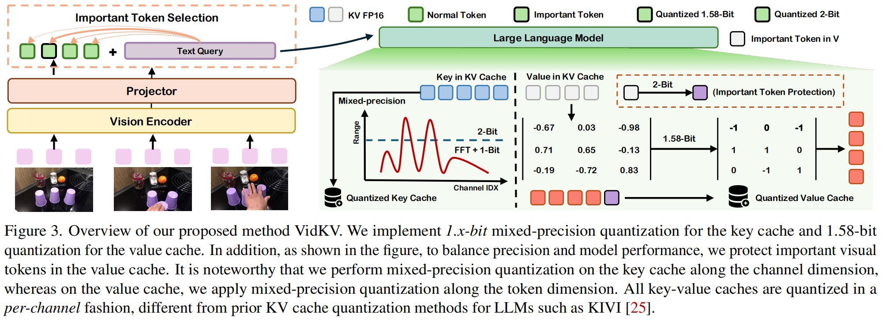

# VidKV: Plug-and-Play _1.x-Bit_ KV Cache Quantization for Video Large Language Models

[Keda Tao](), [Haoxuan You](https://hxyou.github.io/), [Yang Sui](https://eclipsess.github.io/yangsui.github.io/),[Can Qin](https://canqin.tech/), [Huan Wang](https://huanwang.tech/), "Plug-and-Play _1.x-Bit_ KV Cache Quantization for Video Large Language Models"

[[Paper](https://arxiv.org/abs/2503.16257)]

#### 🔥🔥🔥 News

- **2024-3-21:** This repo is released.
- **2024-3-21**: The paper is released.

> **Abstract:** Video large language models (VideoLLMs) have demonstrated the capability to process longer video inputs and enable complex reasoning and analysis. However, due to the thousands of visual tokens from the video frames, key-value (KV) cache can significantly increase memory requirements, becoming a bottleneck for inference speed and memory usage. KV cache quantization is a widely used approach to address this problem. In this paper, we find that 2-bit KV quantization of VideoLLMs can hardly hurt the model performance, while the limit of KV cache quantization in even lower bits has not been investigated. To bridge this gap, we introduce VidKV, a plug-and-play KV cache quantization method to compress the KV cache to lower than 2 bits. Specifically, (1) for key, we propose a mixed-precision quantization strategy in the channel dimension, where we perform 2-bit quantization for anomalous channels and 1-bit quantization combined with FFT for normal channels; (2) for value, we implement 1.58-bit quantization while selectively filtering semantically salient visual tokens for targeted preservation, for a better trade-off between precision and model performance. Importantly, our findings suggest that the value cache of VideoLLMs should be quantized in a per-channel fashion instead of the per-token fashion proposed by prior KV cache quantization works for LLMs. Empirically, extensive results with LLaVA-OV-7B and Qwen2.5-VL-7B on six benchmarks show that VidKV effectively compresses the KV cache to 1.5-bit and 1.58-bit precision with almost no performance drop compared to the FP16 counterparts.
> 

## ⚒️ TODO

* [x] Release Paper 
* [ ] Release code 
* [ ] Support more models

## Contact

If you have any questions, please feel free to contact with me at KD.TAO@outlook.com
